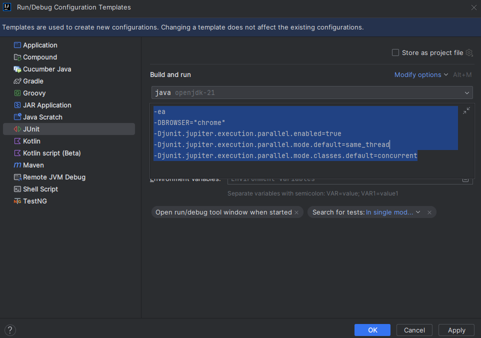

# Automated Testing Framework

This repository contains a Java-based automation framework for web testing using Maven, Selenium, and JUnit 5.

## Table of Contents

- [Introduction](#introduction)
- [Features](#features)
- [Prerequisites](#prerequisites)
- [Setup](#setup)
- [Tests](#tests)
- [Run Tests in Parallel](#run-tests-in-parallel)

## Introduction

This automation framework is designed for web application testing, providing a structured and scalable foundation for writing Selenium-based test scripts. It utilizes Maven as a build tool and JUnit 5 for test execution.

## Features

- **Maven Integration:** Easy dependency management and project configuration.
- **Selenium WebDriver:** Browser automation for interacting with web elements.
- **JUnit 5:** Test execution and assertion framework.
- **Page Object Model (POM):** Organize and maintain test code with a modular approach.
- **Configuration Management:** Centralized configuration for browser settings, URLs, etc.
- **Logging:** To be done using Allure 

## Prerequisites

Before running the tests, ensure you have the following installed:

- Java JDK (version 21)
- Maven (version 20)
- WebDriver (ChromeDriver) compatible with your browser version - make sure you have the latest version of chrome.

## Setup

1. Clone the repository:

   ```bash
   git clone https://github.com/StoicaMG/QTeamFramework.git
   ```

2. Navigate to the project directory:

   ```bash
   cd QTeamFramework
   ```

3. Run tests using Maven:

   ```bash
   mvn clean test -DBROWSER="chrome"
   ```

## Tests

Organize your tests using JUnit 5 annotations. See examples in the `src/test/java/Test` directory.

```java
import org.junit.jupiter.api.Test;

public class SampleTest extends BaseTest {

    @Test
    public void sampleTestCase() {
        // Your test logic here
    }
}
```

## Run tests in parallel

If you want to execute the tests in parallel by classes, make sure you add the following lines in the configuration settings of Junit:
```java
-ea
-DBROWSER="chrome"
-Djunit.jupiter.execution.parallel.enabled=true
-Djunit.jupiter.execution.parallel.mode.default=same_thread
-Djunit.jupiter.execution.parallel.mode.classes.default=concurrent
```

